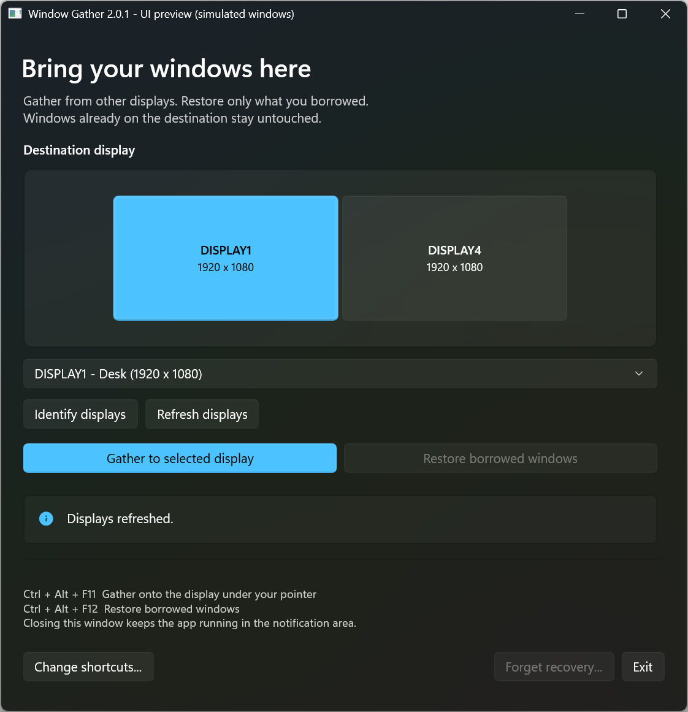

# Window Gather

Bring application windows onto one Windows display. Restore **only what you
borrowed**; windows already on the destination stay untouched.

[Download the latest release](https://github.com/martins-vds/window-gather/releases/latest)
&nbsp; · &nbsp; [Usage & recovery](WindowGather/README.md)
&nbsp; · &nbsp; [Contribute](CONTRIBUTING.md)



*Real WinUI preview with simulated displays and disposable settings. The preview
title shows the development version, not the current release version.*

## Run in three steps

1. Download the **x64** or **ARM64** ZIP for your Windows architecture from
   [Releases](https://github.com/martins-vds/window-gather/releases/latest).
   Compare its hash with the release's `SHA256SUMS.txt`, then extract it.
2. Run `WindowGather.WinUI.exe` directly. Choose the destination in the monitor
   preview or dropdown; **Identify displays** helps match physical monitors.
   Click **Gather to selected display**.
3. Click **Restore borrowed windows** when finished. Closing the app hides it
   in the notification area; use the tray's **Exit** to stop it.

Requires Windows 10 version 1809 or later, or Windows 11, on x64/ARM64.
The self-contained EXE extracts its bundled runtime; no separate .NET or Windows
App SDK installation is needed. Releases are currently **unsigned**. Follow your
organization's security policy; do not bypass security warnings.

Recovery is saved before movement. Closed applications cannot be resurrected;
elevated/protected apps may refuse movement. If the gathering destination is
disconnected, available borrowed windows get one automatic return attempt;
unavailable/failed returns remain pending until an explicit Restore.
The published **v1.0.0** includes this behavior; older historical local 2.x
artifacts and the legacy WinForms frontend are not equivalent release versions.

The default Gather shortcut is Ctrl+Alt+F11. The preserved Restore default,
Ctrl+Alt+F12, may not register because Windows reserves F12 for debuggers;
use **Change shortcuts...** if warned. No telemetry or display-setting changes.

## Build, understand, contribute

On Windows with the SDK pinned in [`global.json`](global.json):

```powershell
git clone https://github.com/martins-vds/window-gather.git
Set-Location window-gather
.\scripts\Verify.ps1
.\scripts\Publish.ps1 -Format SingleFile
```

[Contributor guide](CONTRIBUTING.md) · [Architecture & quality](ARCHITECTURE.md) ·
[Release engineering](RELEASE.md) · [Security reporting](SECURITY.md) ·
[Docs site development](docs/SITE.md)

Native/UI tests are separate interactive suites and move only owned disposable
test windows. [Read the safety rules](CONTRIBUTING.md#test-safely) before running them.

## License

Window Gather is licensed under the [MIT License](LICENSE).
Third-party dependencies retain their respective licenses.
